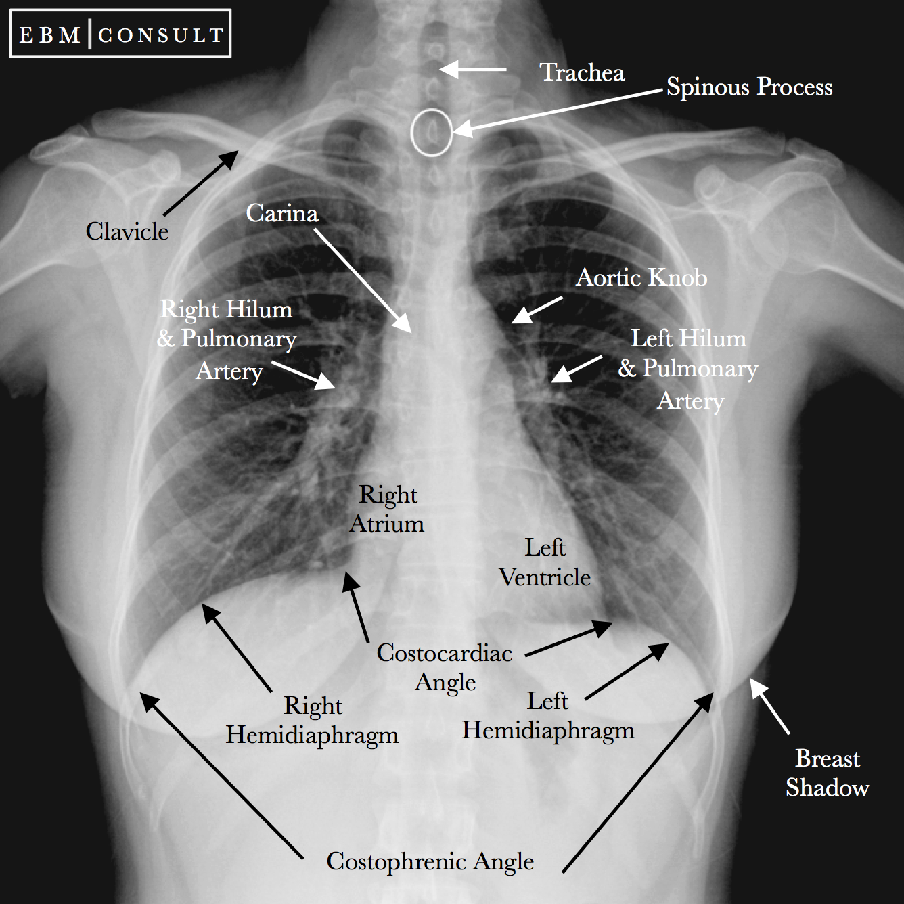

<h1 align='center'>Pneumonia Classification</h1>

# Hi, I'm Fraidoon! 👋, In this project i used transfer learning on chest X-ray dataset to detect whether a patient has pneumonia disease or not.

## Required Skills

- Machine Learning and Deep Learing
- Data Analysis
- Python and able to use required libraries
- Having passion :)

## Steps to follow

- Load dataset from kaggle to colab and unzip it
- EDA (checking null values, whether balance or not...)
- Display dicom file using pydicom library

- Required structure

```
Example of file structure

images
└───train <- training images
│   └───have
│   │   │   ---.jpeg
│   │   │   ---.jpeg
│   │   │   ...
│   └───have_not
│       │   ---.jpeg
│       │   ---.jpeg
│       │   ...
│
└───val <- testing images
│   └───have
│   │   │   ---.jpeg
│   │   │   ---.jpeg
│   │   │   ...
│   └───have_not
│       │   ---.jpeg
│       │   ---.jpeg
│       │   ...

```

- Converting dicom file to jpeg
- Generates a tf.data.Dataset from image files in a directory
- Using Transfer learning
- Checking the accuracy and fine tunning

## Dataset

- [Dataset-Link](https://www.kaggle.com/c/rsna-pneumonia-detection-challenge)

## Description Of Chest X-Ray



## Installation

- Visual Studio, Atom, PyCharm, Jypeter Notebook
- Python
- Numpy
- Pandas
- Matplotlib
- Tensorflow
- pathlib
- pydicom
- cv2
- PIL
- os
- tqdm
- zipfile

## 🚀 About Me

I'm a full time student in the field of computer application at Bangalore University.
I got into AI/ML and DL at the end of 2020. So I made a road map for myself to learn
about AI. Special thank from ML communities for providing amazing materials
related to this are. Dreaming for using AI in heathcare due to coming from medicine background :).
For any feedback contact me through my [Linkedin](https://www.linkedin.com/in/fraidoon-omarzai-8592131b4/).
Thanks!
